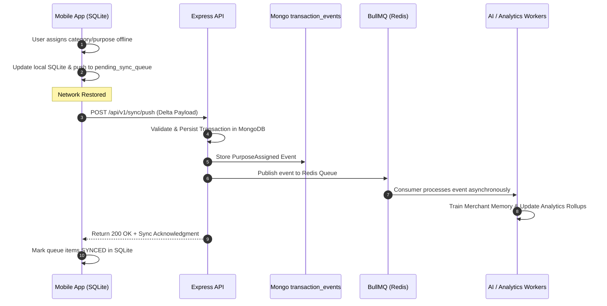

# ADR-002: Offline-First and Event-Driven Architecture

## Status
Approved

## Context
ExpenseFlow AI requires instantaneous user feedback. When a user opens the app or interacts with incoming transaction notifications, waiting for server round-trips over mobile networks introduces unwanted latency. Furthermore, transactions must be captured even when the user has poor or no internet connectivity.

## Decision
We adopt an **Offline-First Event-Driven Architecture**:
1. **Offline-First Data Layer:**
   - The mobile application reads and writes to a local **SQLite database** using `expo-sqlite`.
   - All UI screens render immediately from local SQLite state.
   - Network mutations are written optimistically to SQLite and placed into a local `pending_sync_queue`.
   - TanStack Query acts as an in-memory cache layer over the local SQLite repository.
2. **Event-Driven Backend Engine:**
   - Every transaction state modification produces an immutable event (e.g., `TransactionCreated`, `PurposeAssigned`, `MerchantLearned`, `BudgetExceeded`).
   - Events are stored in the MongoDB `transaction_events` collection as an event log and dispatched via BullMQ / Redis pub-sub channels to trigger downstream side-effects (AI categorization, budget checking, notifications, analytics).

## Event Flow Lifecycle

## Domain Events List
* `TransactionCreated`: Fired when a payment is ingested from SMS payload.
* `TransactionUpdated`: Fired when transaction details (amount, notes, tags) are altered.
* `PurposeAssigned`: Fired when user selects/confirms a category, subcategory, or notes in Inbox.
* `MerchantLearned`: Fired when AI or user assigns a default category mapping to a merchant string.
* `BudgetExceeded`: Fired when transaction spending pushes a category or monthly budget past configured threshold.
* `SubscriptionDetected`: Fired when recurring payment patterns are recognized by AI intelligence.
* `NotificationScheduled`: Fired when a pending inbox review reminder needs to be dispatched.

## Consequences
### Positive
* **Sub-10ms UI Interactions:** Zero spinner delays when opening app or categorizing expenses.
* **Resilience:** Uninterrupted operation in offline/flight mode.
* **Auditability & Replayability:** Complete historical audit trailing through immutable transaction events.

### Negative
* **Sync Complexity:** Edge cases in conflict handling require strict deterministic rules (Last-Write-Wins with Event ID tracing).
* **Storage Dual-Maintenance:** Schemas between MongoDB and local SQLite must stay synchronized via shared TypeScript package definition.
