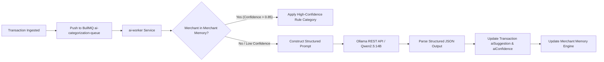

# ADR-004: Local AI Engine (Ollama + Qwen2.5:14B)

## Status
Approved

## Context
ExpenseFlow AI requires intelligent features:
1. Automated transaction categorization & purpose suggestion based on noisy merchant strings (e.g., `SWIGGY*BANGALORE IN` -> `Food & Dining / Delivery`).
2. Detection of recurring subscription models and unexpected cost increases.
3. Natural language conversational financial querying (*"How much did I spend on coffee last month after salary day?"*).
4. Privacy-first requirement: Financial transactions contain sensitive merchant and personal identity data that should not be transmitted to commercial third-party LLM cloud APIs.

## Decision
We implement a localized AI processing architecture using **Ollama** running the **Qwen2.5:14B** open-weights LLM model alongside **LangChain** and **Vector Search Embeddings**.

### Technology Choice Rationale
* **Ollama:** Provides a lightweight, high-performance local C++ inference runtime with structured JSON output enforcement (`format: json`).
* **Qwen2.5:14B:** Demonstrates superior multilingual, zero-shot structured JSON parsing, math reasoning, and complex financial entity extraction capabilities comparable to GPT-4o-mini while operating locally.
* **LangChain:** Manages prompt template composition, Few-Shot example injection, output parsing, and embedding pipelines.

### Asynchronous Worker Architecture
AI processing is strictly decoupled from the main HTTP API server:
* `ai-worker` service subscribes to BullMQ queues (`ai-categorization-queue`, `ai-insights-queue`, `ai-chat-queue`).
* HTTP requests return immediately with `aiStatus: PENDING` or rule-based fallback, and AI enrichment updates the transaction asynchronously via WebSocket / Push Notification.

## Vector Search & Embeddings Pipeline
* **Embeddings Model:** `nomic-embed-text` via Ollama or local ONNX runtime.
* **Vector Store:** MongoDB Vector Search index on `ai_memory` collection.
* **Document Chunking:** Historical transactions, category taxonomies, and user spending notes are vectorized into 768-dimensional embeddings to enable semantic natural language retrieval for conversational financial assistant features.

## Consequences
### Positive
* **100% Privacy & Data Ownership:** Zero financial transaction payloads leave the user's local hardware / private server instance.
* **Zero API Per-Token Costs:** Unlimited categorization and chat queries without OpenAI / Anthropic cloud billing.
* **Reliable JSON Parsing:** Qwen2.5:14B strictly adheres to Zod schema constraints when generating transaction DTOs.

### Negative
* **Resource Requirements:** Host machine requires minimum 16GB RAM (32GB recommended) or dedicated GPU VRAM for fluid Qwen2.5:14B inference speeds.
* **Fallback Strategy:** If Ollama is offline or processing times out (>3s), system falls back gracefully to `@expenseflow/parser-engine` rule-based heuristics.
