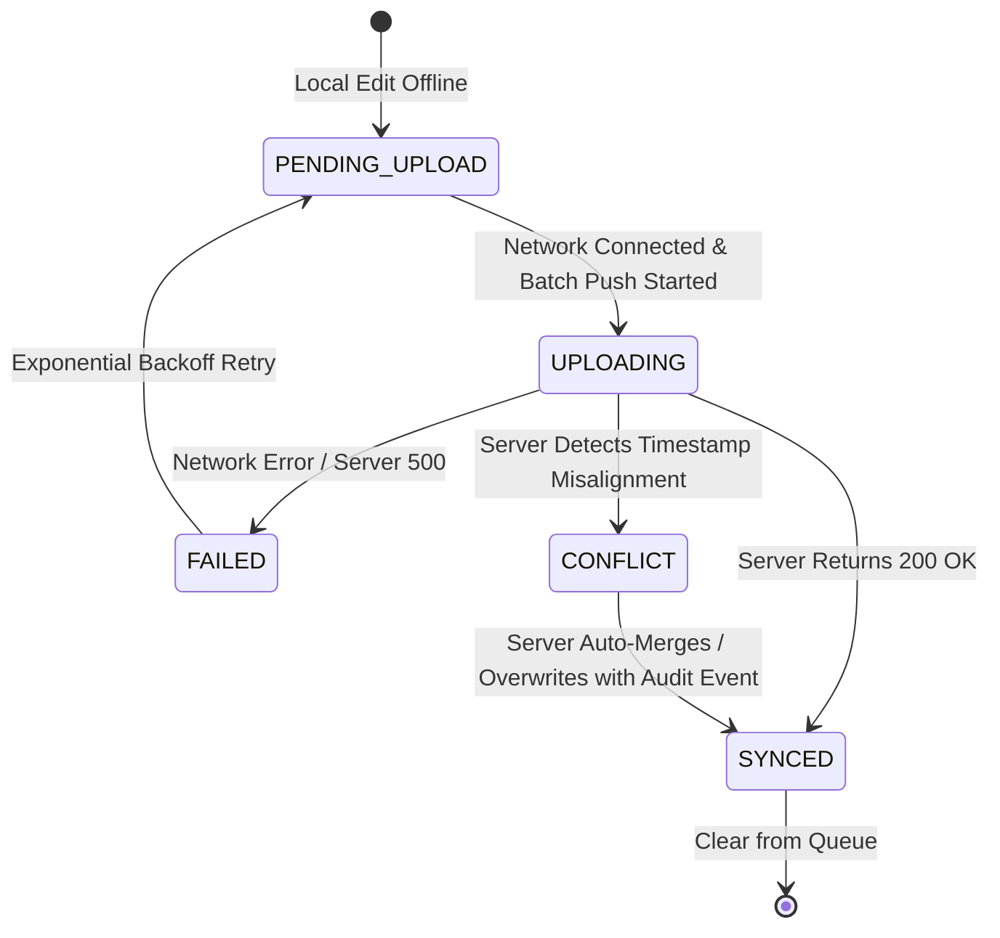

# ADR-005: MongoDB & SQLite Dual Storage & Sync Strategy

## Status
Approved

## Context
ExpenseFlow AI utilizes a dual-database architecture:
1. **Primary Cloud / Self-Hosted Storage:** MongoDB (Mongoose schemas, compound indexes, event logs, aggregation pipelines).
2. **Mobile Client Storage:** SQLite (`expo-sqlite`, zero-latency offline read/write repository).

We must define how client state (SQLite) synchronizes with server state (MongoDB) without data loss, race conditions, or duplicate transaction creation.

## Decision
We adopt a **Queue-Based Delta Sync Strategy** with **Deterministic Last-Write-Wins (LWW) Conflict Resolution** and **Event Log Verification**.

### Data Synchronization Flow
1. **Local Writes (Optimistic Execution):**
   - When a user categorizes a transaction offline, SQLite updates local `local_transactions` and appends an entry to `pending_sync_queue`:
     - `queue_id`: UUIDv4
     - `entity_type`: `TRANSACTION` | `CATEGORY` | `MERCHANT`
     - `operation`: `CREATE` | `UPDATE` | `DELETE`
     - `payload`: JSON string of changed fields
     - `client_timestamp`: ISO-8601 string
     - `status`: `PENDING_UPLOAD`
2. **Sync Push (`POST /api/v1/sync/push`):**
   - Mobile app detects network connectivity and pushes batch of `pending_sync_queue` items.
   - Server processes mutations within a MongoDB session/transaction:
     - Check `updatedAt` server timestamp against `client_timestamp`.
     - If `server.updatedAt > client_timestamp`, server applies conflict resolution logic (retains server version or merges non-conflicting fields).
     - Save new `TransactionUpdated` or `PurposeAssigned` event to `transaction_events`.
   - Server responds with array of resolved IDs and sync status (`SYNCED`, `CONFLICT_RESOLVED`, `FAILED`).
3. **Sync Pull (`POST /api/v1/sync/pull`):**
   - Mobile app requests delta changes since `lastSyncTimestamp`.
   - Server queries MongoDB for entities modified where `updatedAt > lastSyncTimestamp`.
   - Server returns delta changes payload.
   - Mobile app updates SQLite inside an atomic transaction and advances local `lastSyncTimestamp`.

## Conflict Resolution Rules
* **Transaction Ingestion (SMS):** Server fingerprint generation (`amount + merchant + reference + date`) guarantees idempotency. Duplicate uploads return existing server transaction ID without duplicating records.
* **User Categorization:** If a user categorizes a transaction on mobile while web dashboard edits notes simultaneously, server merges fields (`category` from mobile, `notes` from web).
* **Hard Conflict:** If both client and server update category to different values, server LWW (Last-Write-Wins based on server receive time) prevails, and a `SyncConflictResolved` audit log is created.

## Consequences
### Positive
* **Seamless Offline UX:** User never sees loading spinners or sync blockades while editing expenses.
* **Idempotent API Processing:** Fingerprinting prevents duplicate transaction entries even if network retries multiply requests.
* **Compact Bandwidth Usage:** Only modified fields (deltas) are transmitted over the wire.

### Negative
* **Schema Synchronization:** SQLite migrations must be kept strictly compatible with MongoDB schema changes.
