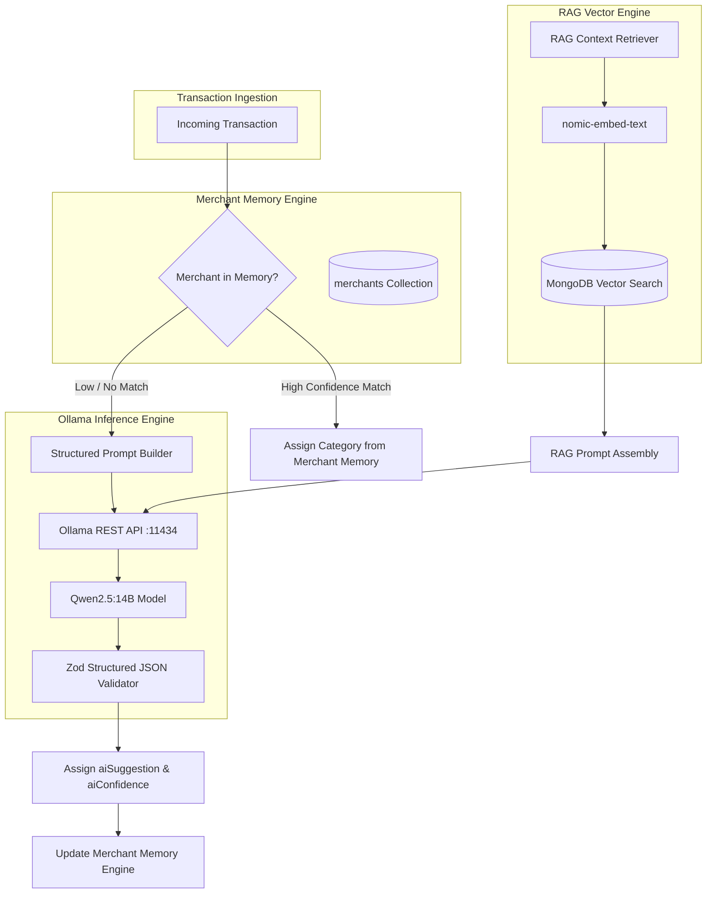

# AI Systems Architecture

## Executive Overview

ExpenseFlow AI integrates a localized, privacy-first AI intelligence subsystem powered by **Ollama**, running the **Qwen2.5:14B** language model alongside vector embedding engines. The AI architecture operates strictly as an asynchronous background worker service (`ai-worker`) decoupled from the primary REST API.

---

## Core AI Subsystems



---

## AI Workers & Queue System

AI tasks are queued in Redis via BullMQ to preserve fast API response times:

1. **`ai-categorization-queue`:**
   - Input: Unapproved transaction payload (`amount`, `merchant`, `bank`, `paymentMethod`, `rawSMS`).
   - Operation: Invokes Qwen2.5:14B to output category, subcategory, purpose summary, and confidence score.
2. **`embedding-worker-queue`:**
   - Input: Approved transaction, spending note, or user query.
   - Operation: Computes 768-dim vector embedding using `nomic-embed-text` and upserts to MongoDB `ai_memory`.
3. **`insight-worker-queue`:**
   - Input: Weekly / Monthly spend summaries.
   - Operation: Scans for unexpected price spikes, subscription renewals, or overbudget warnings.
4. **`chat-worker-queue`:**
   - Input: Natural language query from Web/Mobile chat UI.
   - Operation: Executes RAG vector lookup over financial context and streams response back via WebSocket/HTTP SSE.

---

## Ollama Prompt Templates

### Transaction Categorization Prompt

```text
You are ExpenseFlow AI, an expert financial classifier.
Analyze the following bank transaction details and output ONLY a JSON object adhering to the specified format.

Transaction Context:
- Raw Text: "{{rawSMS}}"
- Extracted Merchant: "{{merchant}}"
- Amount: ₹{{amount}}
- Payment Method: "{{paymentMethod}}"
- Bank: "{{bank}}"

Available Main Categories:
[Food & Dining, Transportation, Shopping, Bills & Utilities, Entertainment, Health & Fitness, Travel, Financial Services, Income, Miscellaneous]

Return JSON in this exact structure:
{
  "category": "<Main Category>",
  "subcategory": "<Subcategory>",
  "suggestedPurpose": "<Short 3-5 word concise purpose>",
  "confidence": <Float between 0.0 and 1.0>,
  "reasoning": "<1 sentence rationale>",
  "suggestedTags": ["tag1", "tag2"]
}
```

---

## Merchant Memory Feedback Loop

1. **Rule Learning:** When a user confirms or corrects an inbox item (e.g., reassigns `SWIGGY` from `Shopping` to `Food & Dining`), the `MerchantLearned` event fires.
2. **Confidence Accumulation:**
   - The `merchants` collection updates:
     - `defaultCategory`: Set to selected category.
     - `frequency`: Incremented by 1.
     - `confidenceScore`: Recalculated as `(UserConfirmedCount / TotalCount)`.
3. **Fast-Bypass Rule:** If `confidenceScore > 0.85` and `frequency >= 3`, future transactions for that merchant bypass Ollama inference and execute instant category mapping in `< 5ms`.
