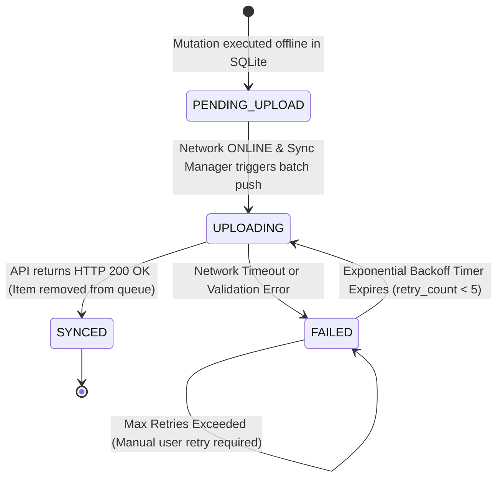
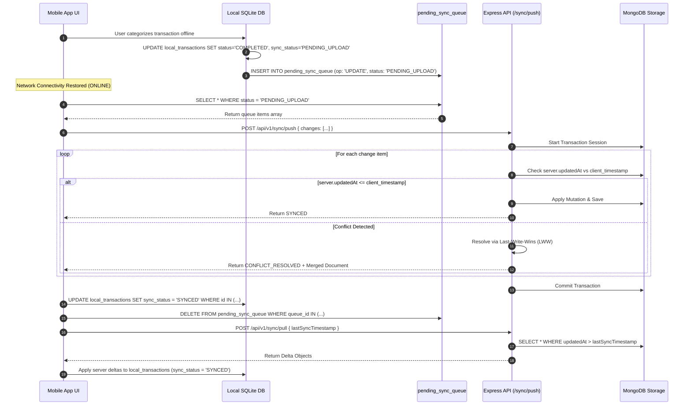

# Offline Sync Architecture Specification

## 1. Overview
ExpenseFlow AI V1.1 operates on an **Offline-First Storage Engine**. All client reads and writes execute against a local SQLite database (`expo-sqlite`). Background network sync processes flush offline queue mutations to MongoDB when internet connectivity is available.

---

## 2. Scope
* **Included in V1.1:** Local SQLite schemas (`local_transactions`, `pending_sync_queue`, `local_categories`, `local_merchants`), `status` vs `sync_status` separation, queue state machine, exponential backoff retry lifecycle, delta push/pull synchronization, timestamp Last-Write-Wins (LWW) conflict resolution, and reconnect trigger.
* **Excluded in V1.1:** Peer-to-peer device mesh sync.

---

## 3. Responsibilities
* **Mobile Client (`apps/mobile`):** Performs local SQLite reads/writes, manages deep-link fallback `expenseflow://capture`, and maintains `pending_sync_queue`.
* **Sync Controller (`apps/api`):** Processes `POST /api/v1/sync/push` and `POST /api/v1/sync/pull` payloads inside Mongoose transactions and calculates delta pull responses.

---

## 4. Column Separation: `status` vs `sync_status`

The `local_transactions` table cleanly separates **Domain Lifecycle Status** (`status`) from **Sync Engine Lifecycle Status** (`sync_status`):

* **`status` (Domain Lifecycle):**
  - `CAPTURED`: Raw payment SMS received.
  - `PENDING_CATEGORY`: Parsed; awaiting user Inbox confirmation.
  - `COMPLETED`: User confirmed category & purpose.
  - `IGNORED`: Dismissed by user.
  - `ARCHIVED`: Soft deleted.

* **`sync_status` (Sync Engine Lifecycle):**
  - `SYNCED`: Identical on local SQLite and remote MongoDB.
  - `PENDING_UPLOAD`: Modified locally offline; queued in `pending_sync_queue`.
  - `FAILED`: In-flight upload failed; waiting for backoff retry.
  - `CONFLICT`: Timestamp conflict detected; resolved via Last-Write-Wins.

---

## 5. Offline Sync Queue State Machine



---

## 6. Exponential Backoff Retry Policy

When an in-flight sync push request fails, the Background Sync Manager applies an exponential backoff formula:

\[ t_{\text{retry}} = 2^n \times 1\text{ second} + \text{jitter} \]

| Retry Count ($n$) | Backoff Delay | Action |
| :---: | :--- | :--- |
| **0** | $1\text{ sec}$ | Initial automatic retry upon network reconnect. |
| **1** | $2\text{ sec}$ | Second attempt. |
| **2** | $4\text{ sec}$ | Third attempt. |
| **3** | $8\text{ sec}$ | Fourth attempt. |
| **4** | $16\text{ sec}$ | Fifth attempt. |
| **5 (Max)** | $32\text{ sec}$ | Queue status set to `FAILED`. UI displays "Sync Error — Tap to Retry" badge in Settings. |

---

## 7. SQLite Queue Payload Example

The `pending_sync_queue` stores mutation payloads serialized as JSON strings:

```json
{
  "queueId": "q_98712345-a1b2-4c3d-8e9f-123456789abc",
  "entityId": "tx_65d8b1e42a9f8c12b704901f",
  "entityType": "TRANSACTION",
  "operation": "UPDATE",
  "payload": {
    "category": "Food & Dining",
    "purpose": "Client coffee meeting",
    "notes": "Discussed Q3 project roadmap",
    "status": "COMPLETED"
  },
  "clientTimestamp": "2026-08-29T12:05:00.000Z",
  "status": "PENDING_UPLOAD",
  "retryCount": 0
}
```

---

## 8. Last-Write-Wins (LWW) Conflict Resolution Example

If a transaction is edited locally on mobile offline while simultaneously updated on the Web Dashboard:

1. **Mobile Mutation (Offline):** `clientTimestamp = "2026-08-29T12:05:00.000Z"`, `category = "Food & Dining"`.
2. **Web Mutation (Online):** `serverUpdatedAt = "2026-08-29T12:04:00.000Z"`, `category = "Office Expenses"`.
3. **Reconciliation Logic:** The API Gateway compares `clientTimestamp` ($12:05:00$) against `serverUpdatedAt` ($12:04:00$).
4. **Resolution:** Since $12:05:00 > 12:04:00$, the Mobile edit wins. The document is updated to `"Food & Dining"` and an event log entry `ConflictResolvedLWW` is stored.

---

## 9. Queue Lifecycle & Sync Sequence Diagram



---

## 10. Acceptance Criteria

### Feature Completion Checklist
- [x] SQLite DDL schemas (`local_transactions`, `pending_sync_queue`, `local_categories`, `local_merchants`) specified.
- [x] Clear separation of domain `status` vs sync `sync_status` documented.
- [x] Offline sync queue state machine diagram provided.
- [x] Exponential backoff retry policy table detailed.
- [x] SQLite queue payload JSON example provided.
- [x] Last-Write-Wins (LWW) conflict resolution example documented.

---

## 11. Future Improvements (V2 Upgrade Path)
* **CRDT Data Structures:** Conflict-Free Replicated Data Types for multi-device live offline merging.
