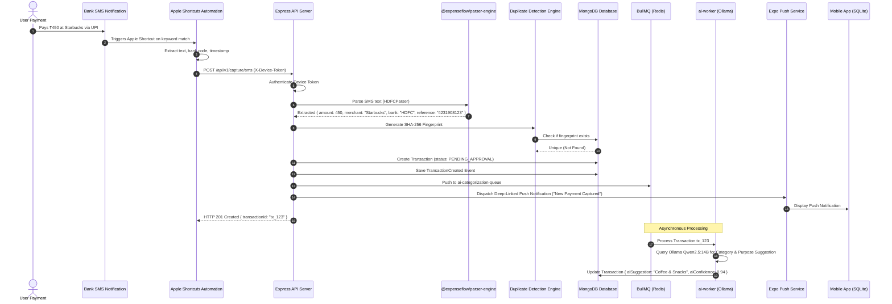
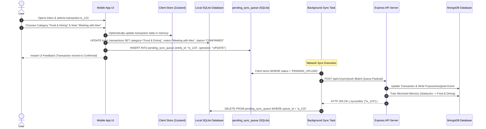
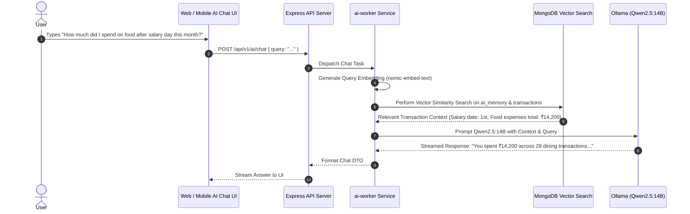

# System Sequence Diagrams

This document details sequence flows across key product journeys.

---

## 1. SMS Capture to Inbox Processing Flow

---

## 2. Mobile Inbox Purpose Assignment Flow (Offline-First)

---

## 3. Conversational AI Query Flow

