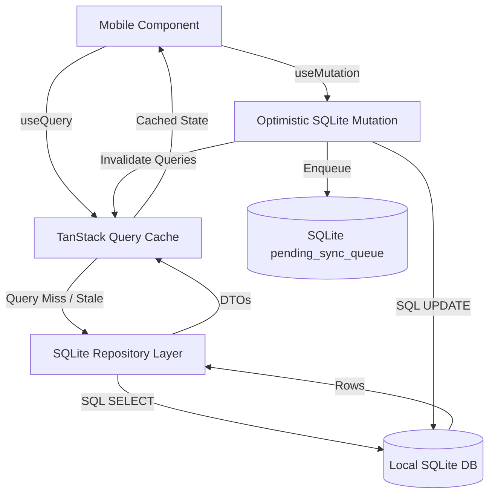

# State Management Architecture

## Overview

ExpenseFlow AI uses a dual-state architecture designed specifically for mobile (Expo React Native) and web (Next.js App Router) applications:

1. **Server State Management:** TanStack Query (React Query v5) handles server synchronization, caching, query invalidation, and background refetching.
2. **Client UI State Management:** Zustand handles ephemeral UI state (active tab, search filters, modal states, offline queue tracking).
3. **Persistent Offline Storage (Mobile):** `expo-sqlite` acts as the persistent physical storage layer on mobile devices, while `Expo SecureStore` stores sensitive tokens.

---

## State Responsibilities Matrix

| State Type | React Native Mobile | Next.js Web Dashboard | Tooling |
| :--- | :--- | :--- | :--- |
| **Server Data (Transactions, Analytics)** | TanStack Query + SQLite Repository Layer | TanStack Query + API SDK Client | TanStack Query v5 |
| **Global Client UI State** | Zustand (`useUIStore`, `useFilterStore`) | Zustand (`useUIStore`, `useDashboardStore`) | Zustand |
| **Form State** | React Hook Form + Zod Resolver | React Hook Form + Zod Resolver | React Hook Form |
| **Offline Sync Queue State** | SQLite `pending_sync_queue` + Zustand Sync Monitor | N/A (Online Web Application) | `expo-sqlite` |
| **Auth & Security Credentials** | `Expo SecureStore` + Auth Zustand Slice | HTTP-only Cookies + Auth Context | JWT Tokens |

---

## Mobile State Architecture (Offline-First Query Pattern)

In the mobile app, TanStack Query is coupled directly to local SQLite repositories instead of issuing direct HTTP fetches:

### Why Redux was Rejected
* **Boilerplate & Weight:** Redux Toolkit adds unnecessary verbosity and bundle size for an offline-first application where TanStack Query and Zustand provide clearer separation between server data and UI state.
* **Complex Offline Sync Integration:** Managing offline sync queues inside Redux middleware introduces tightly coupled side-effects. SQLite + Zustand provides an explicit, testable queue architecture.

---

## Client Stores (Zustand Slices)

### 1. `useAuthStore`
* State: `user`, `isAuthenticated`, `deviceToken`, `accessToken`.
* Actions: `login()`, `logout()`, `setDeviceToken()`.

### 2. `useInboxStore`
* State: `pendingTransactions`, `selectedIndex`, `activeFilter`.
* Actions: `selectNext()`, `confirmTransaction()`, `bulkCategorize()`.

### 3. `useSyncStore`
* State: `isOnline`, `syncStatus` (`IDLE` | `SYNCING` | `ERROR`), `pendingCount`, `lastSyncedAt`.
* Actions: `setOnlineStatus()`, `triggerSync()`, `setSyncProgress()`.

### 4. `useFilterStore`
* State: `dateRange`, `selectedCategories`, `selectedMerchants`, `searchQuery`, `paymentMethods`.
* Actions: `setDateRange()`, `toggleCategory()`, `resetFilters()`.
