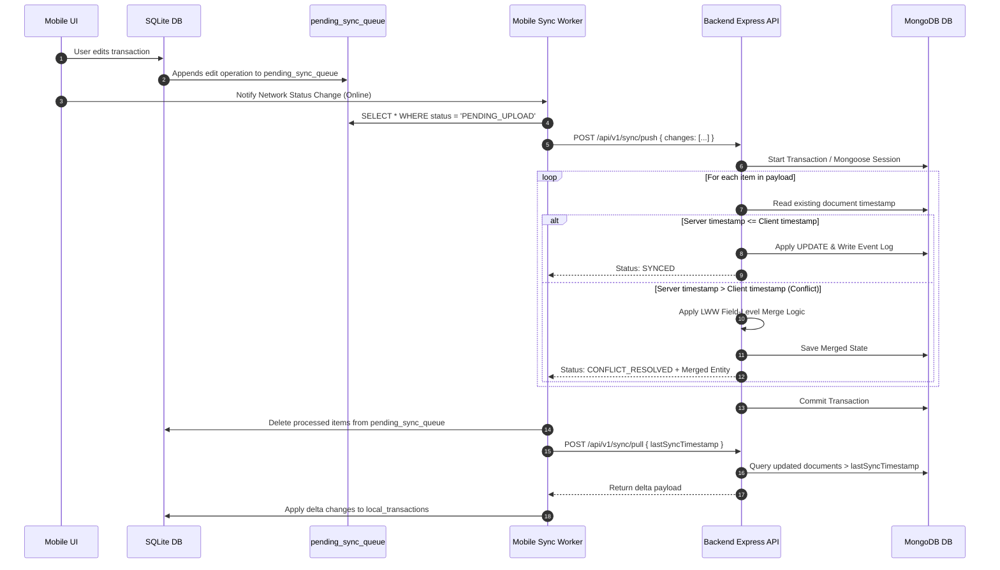

# Sync Engine & Conflict Resolution Specification

## Architectural Objective

The Sync Engine enables ExpenseFlow AI to operate seamlessly offline on mobile devices while maintaining data integrity across MongoDB and SQLite stores.

---

## SQLite Data Model (`expo-sqlite`)

The mobile client maintains a local mirror of core entities alongside a dedicated synchronization queue table:

```sql
-- Local Transactions Table
CREATE TABLE IF NOT EXISTS local_transactions (
    id TEXT PRIMARY KEY NOT NULL,
    fingerprint TEXT UNIQUE NOT NULL,
    amount REAL NOT NULL,
    merchant TEXT NOT NULL,
    merchant_id TEXT,
    bank TEXT NOT NULL,
    payment_method TEXT NOT NULL,
    account_masked TEXT,
    reference TEXT,
    occurred_at TEXT NOT NULL,
    category TEXT,
    subcategory TEXT,
    purpose TEXT,
    notes TEXT,
    tags TEXT, -- JSON Array string
    ai_suggestion TEXT,
    ai_confidence REAL,
    status TEXT NOT NULL DEFAULT 'PENDING_APPROVAL',
    sync_status TEXT NOT NULL DEFAULT 'SYNCED',
    created_at TEXT NOT NULL,
    updated_at TEXT NOT NULL
);

-- Pending Sync Queue Table
CREATE TABLE IF NOT EXISTS pending_sync_queue (
    queue_id TEXT PRIMARY KEY NOT NULL,
    entity_id TEXT NOT NULL,
    entity_type TEXT NOT NULL, -- TRANSACTION | CATEGORY | MERCHANT
    operation TEXT NOT NULL,    -- CREATE | UPDATE | DELETE
    payload TEXT NOT NULL,      -- JSON payload string
    client_timestamp TEXT NOT NULL,
    status TEXT NOT NULL DEFAULT 'PENDING_UPLOAD',
    retry_count INTEGER NOT NULL DEFAULT 0,
    last_error TEXT
);

CREATE INDEX IF NOT EXISTS idx_sync_queue_status ON pending_sync_queue(status);
CREATE INDEX IF NOT EXISTS idx_local_tx_status ON local_transactions(status);
```

---

## Sync Flow & Lifecycle



---

## Conflict Resolution Matrix

| Conflict Scenario | Resolution Strategy | Action |
| :--- | :--- | :--- |
| **SMS Ingestion vs Manual Edit** | Primary Key / Fingerprint Match | Retain SMS invariant fields (`amount`, `bank`, `occurredAt`); apply user edits to `category`, `notes`, `purpose`. |
| **Mobile Offline Edit vs Web Edit** | Field-Level Last-Write-Wins (LWW) | Non-overlapping fields merged. Overlapping fields resolved in favor of highest `updatedAt` timestamp. |
| **Category Deletion Conflict** | Tombstone Validation | If category deleted on web while mobile assigns transaction to it, transaction assigned to parent category or `Miscellaneous`. |
| **Duplicate Sync Push** | Idempotency Verification | If `queue_id` already acknowledged, server returns HTTP 200 without re-executing. |
