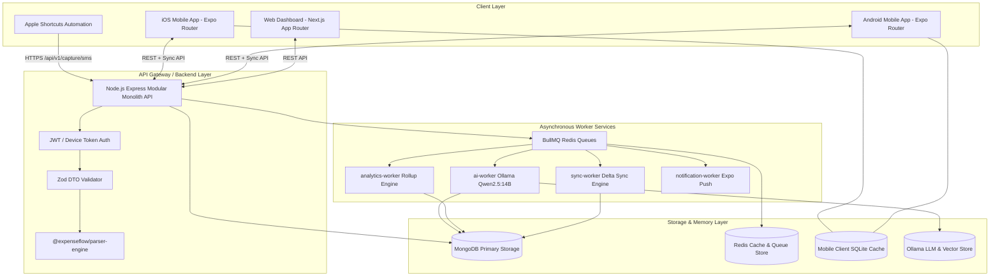

# System Architecture Specification

## Architectural Overview

ExpenseFlow AI is designed as an **Offline-First Event-Driven Modular Monolith** structured within a Turborepo monorepo. It cleanly segregates client applications (Expo React Native Mobile, Next.js Web Dashboard), core backend domain contexts (Express API), domain background workers (AI, Analytics, Notifications, Sync), and reusable packages.

---

## Bounded Context Boundaries

Each domain bounded context manages its own models, repositories, business services, controllers, DTOs, events, and unit tests:

| Bounded Context | Responsibilities | Key Dependencies | Primary Models |
| :--- | :--- | :--- | :--- |
| **Capture Context** | Ingestion of raw SMS payloads via Apple Shortcuts, raw parsing, bank identification | `@expenseflow/parser-engine`, Zod | `transaction_events`, `audit_logs` |
| **Transactions Context** | Core transaction lifecycle, fingerprinting, Inbox pending approvals, state transitions | `@expenseflow/database`, Zod | `transactions`, `transaction_events` |
| **Categories Context** | Nested category taxonomy management, color/icon assignments, budget mappings | `@expenseflow/database` | `categories` |
| **Merchants Context** | Merchant intelligence memory, string normalization, confidence scores | `@expenseflow/database` | `merchants` |
| **AI Context** | Ollama Qwen2.5:14B prompt generation, embedding vectors, natural language chat | Ollama REST, LangChain, BullMQ | `ai_memory`, `merchants` |
| **Analytics Context** | Aggregated spend rollups (daily, weekly, monthly, category, merchant, time of day) | MongoDB Aggregation Pipelines | `transactions`, `categories` |
| **Budgets Context** | Spending limit calculations, rollover logic, overspending alerts | Redis, BullMQ | `budgets`, `transactions` |
| **Notifications Context**| Deep-linked Expo push notifications, 9 PM daily digest scheduling | Expo Push SDK, Scheduler | `notifications`, `device_tokens` |
| **Sync Context** | Delta sync payload processing, LWW conflict resolution, SQLite reconciliation | SQLite DTOs, Mongoose Sessions | `sync_state`, `transactions` |
| **Users & Auth Context**| JWT generation/rotation, OAuth (Apple/Google), device token authorization | bcrypt, jsonwebtoken, Expo SecureStore | `users`, `device_tokens` |

---

## High Availability & Resilience Principles

1. **Graceful Degradation:** If Ollama AI is offline, transaction categorization falls back to `@expenseflow/parser-engine` rule-based heuristics and Merchant Memory without breaking HTTP ingestion.
2. **Idempotent Ingestion:** Every incoming SMS payload is assigned a deterministic SHA-256 fingerprint generated from `(amount + merchant + reference + date_day + payment_method)`. Duplicate webhooks return HTTP 200 with the existing transaction object.
3. **Event-Driven Decoupling:** Heavy side-effects (vector embeddings, analytics rollups, budget threshold evaluations) are pushed to BullMQ queues and executed asynchronously outside the API request-response lifecycle.
