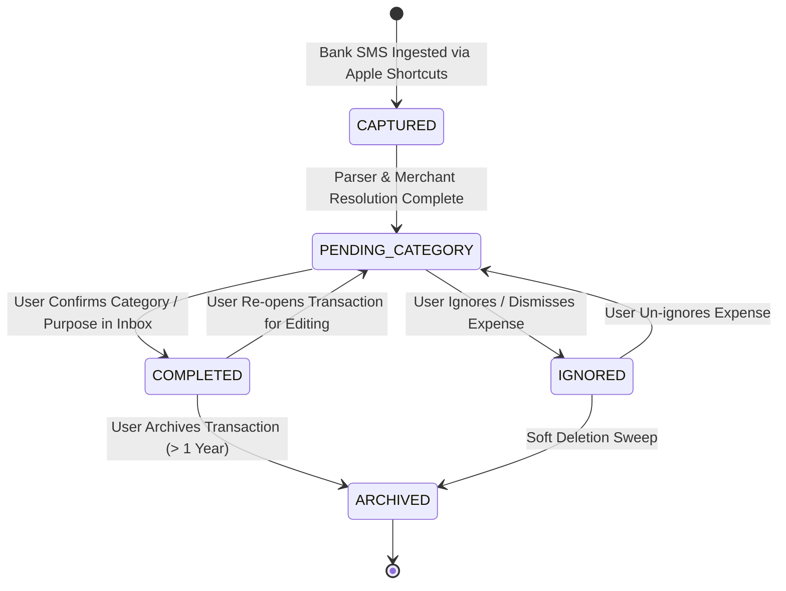

# Transaction State Machine Architecture

## 1. Overview
The Transaction State Machine governs the exact lifecycle, state transitions, triggers, and storage mutations of every financial event captured by ExpenseFlow AI.

---

## 2. Scope
* **Included in V1.1:** 5 core states (`CAPTURED`, `PENDING_CATEGORY`, `COMPLETED`, `IGNORED`, `ARCHIVED`), state transition triggers, database mutations (SQLite and MongoDB), and event logging.
* **Excluded in V1.1:** Multi-state escrow, partial payment states (reserved for V2).

---

## 3. Responsibilities
* **Parser Engine / Ingestion API:** Ingests SMS payloads and transitions new expenses to `CAPTURED` or `PENDING_CATEGORY`.
* **Mobile / Web Client:** Allows user to confirm or edit transactions, transitioning them to `COMPLETED`, `IGNORED`, or `ARCHIVED`.
* **Sync Engine:** Reconciles state transitions between mobile SQLite and MongoDB stores.

---

## 4. State Diagram & Transition Matrix

---

## 5. Detailed State Transition Rules

### State 1: `CAPTURED`
* **Description:** Raw bank SMS received at API Gateway; payload validated but domain entity not fully constructed.
* **Trigger:** HTTP `POST /api/v1/capture/sms` request from Apple Shortcuts.
* **Backend Event:** `TransactionCreated` event recorded.
* **SQLite Mutation:** None (transient network state).
* **MongoDB Mutation:** Inserts record with `status = 'CAPTURED'`.
* **Notification:** None.

---

### State 2: `PENDING_CATEGORY`
* **Description:** Payment parsed and stored; awaiting user category confirmation or purpose enrichment in Inbox.
* **Trigger:** `@expenseflow/parser-engine` completes parsing & SHA-256 fingerprint generation.
* **User Action:** None yet (item lands in Inbox).
* **Backend Event:** `TransactionPendingCategory` event.
* **SQLite Mutation:** `INSERT INTO local_transactions (status) VALUES ('PENDING_CATEGORY')`.
* **MongoDB Mutation:** `UPDATE transactions SET status = 'PENDING_CATEGORY'`.
* **Notification:** Dispatches Expo Push Notification ("New Payment Captured: Starbucks ₹450").

---

### State 3: `COMPLETED`
* **Description:** User has selected or confirmed the category, subcategory, purpose notes, or tags.
* **Trigger:** User taps "Confirm" or selects category in Inbox / Transaction Modal.
* **User Action:** Selects category from picker sheet.
* **Backend Event:** `PurposeAssigned` event.
* **SQLite Mutation:** `UPDATE local_transactions SET status = 'COMPLETED', category = ?, notes = ?`.
* **MongoDB Mutation:** `UPDATE transactions SET status = 'COMPLETED', category = ?, notes = ?`.
* **Notification:** Clears pending Inbox reminder push notification.

---

### State 4: `IGNORED`
* **Description:** Transaction dismissed by user (e.g. non-expense bank transfer or duplicate alert).
* **Trigger:** User swipes left on Inbox item and taps "Ignore".
* **User Action:** Taps "Ignore Expense".
* **Backend Event:** `TransactionIgnored` event.
* **SQLite Mutation:** `UPDATE local_transactions SET status = 'IGNORED'`.
* **MongoDB Mutation:** `UPDATE transactions SET status = 'IGNORED'`.
* **Notification:** Clears notification.

---

### State 5: `ARCHIVED`
* **Description:** Soft-deleted or historical transaction retained for audit trailing.
* **Trigger:** User deletes expense or system archive sweep ($> 365\text{ days}$).
* **User Action:** Taps "Delete Expense" in transaction details.
* **Backend Event:** `TransactionArchived` event.
* **SQLite Mutation:** `UPDATE local_transactions SET status = 'ARCHIVED'`.
* **MongoDB Mutation:** `UPDATE transactions SET status = 'ARCHIVED'`.

---

## 6. Error Handling Strategy
* **Invalid State Transitions:** Attempting to transition directly from `CAPTURED` to `ARCHIVED` throws an `INVALID_STATE_TRANSITION` error.
* **Sync Conflict Resolution:** If client sets `COMPLETED` while web sets `IGNORED`, Last-Write-Wins (LWW) timestamp rule resolves the final state with an event audit log.

---

## 7. Offline Behavior Summary
* All state transitions execute locally in SQLite immediately (`status` column update).
* State change payload is serialized into `pending_sync_queue` for server reconciliation upon reconnection.

---

## 8. Acceptance Criteria

### Feature Completion Checklist
- [x] All 5 transaction states (`CAPTURED`, `PENDING_CATEGORY`, `COMPLETED`, `IGNORED`, `ARCHIVED`) defined.
- [x] State transition triggers, user actions, backend events, and database mutations documented.
- [x] Mermaid state machine diagram included.

### Testing Checklist
- [x] Verify Inbox swipe action updates SQLite status to `COMPLETED`.
- [x] Verify delete action transitions status to `ARCHIVED`.

---

## 9. Future Improvements (V2 Upgrade Path)
* **Partial Settlement State (`PARTIALLY_REFUNDED`):** Track partial refunds against original transactions.
* **Escrow Hold State (`ON_HOLD`):** For pending authorization holds on credit card payments.
