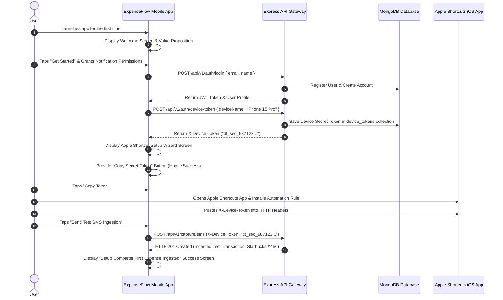
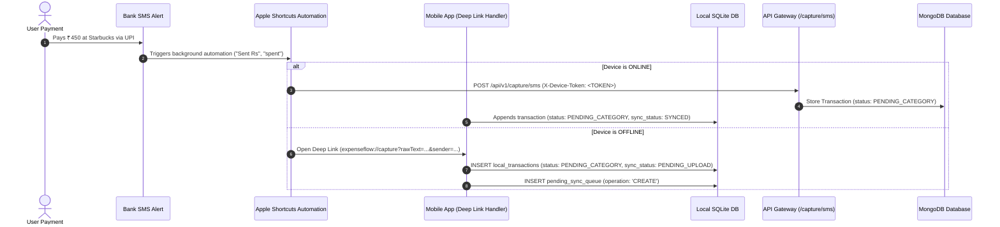
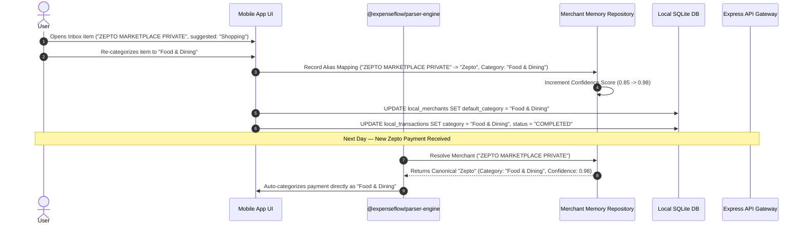
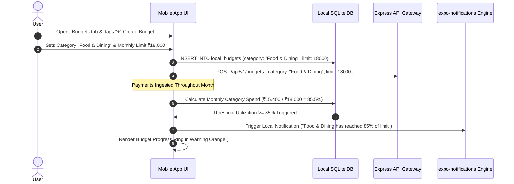

# User Flow Bible

## 1. Overview
The User Flow Bible documents every user journey within ExpenseFlow AI V1.1 from the user's perspective. It specifies screen transitions, triggers, UI actions, API calls, SQLite offline mutations, MongoDB synchronization, offline fallbacks, and error scenarios.

---

## 2. Scope
* **Included in V1.1:** Authentication (Splash, Login, Logout), First Launch & Apple Shortcut Setup Wizard, Transaction Management (SMS Capture, Inbox Approval, Edit, Manual Expense, Delete), Merchant Memory Learning Flow, Budget Lifecycle Management, Core Usage (Home Dashboard, Timeline, Analytics, Search UX, Budgets, Settings), and Offline/Sync Reconnection workflows.
* **Excluded in V1.1:** Multi-user tenant switching, social expense sharing, and cloud family groups (reserved for V2).

---

## 3. Responsibilities
* **Client App (`apps/mobile`):** Renders UI screens, executes Reanimated transitions, manages optimistic local SQLite updates, listens to deep link URLs (`expenseflow://capture`), and manages network connectivity triggers.
* **API Gateway (`apps/api`):** Validates DTO requests, authenticates JWT sessions and device tokens, and persists user transactions to MongoDB.

---

## 4. Data Model & Sequence Catalog

### Summary of User Flows
1. **Auth:** Splash $\rightarrow$ Login $\rightarrow$ Logout.
2. **First Launch & Setup:** Onboarding Welcome $\rightarrow$ Permission Request $\rightarrow$ Device Token Generation $\rightarrow$ Apple Shortcut Wizard $\rightarrow$ Test SMS Verification $\rightarrow$ Success.
3. **Transactions:** SMS Payment Capture $\rightarrow$ Inbox Review & Confirmation $\rightarrow$ Edit Expense $\rightarrow$ Add Manual Expense $\rightarrow$ Delete Expense.
4. **Merchant Learning:** Category Overridden by User $\rightarrow$ Merchant Alias Memory Updated $\rightarrow$ Future SMS Auto-Categorized.
5. **Budget Lifecycle:** Create Budget $\rightarrow$ Track Spend $\rightarrow$ Threshold Alert ($85\%$) Triggered $\rightarrow$ Visual Progress Ring Update.
6. **App Usage:** Dashboard Navigation $\rightarrow$ Calendar Timeline $\rightarrow$ Analytics Breakdown $\rightarrow$ Natural Search $\rightarrow$ Budget Management $\rightarrow$ Settings.
7. **Offline & Sync:** Offline Payment Capture via Deep Link $\rightarrow$ Reconnect Delta Push/Pull.

---

## 5. User Flows & Sequence Diagrams

### Journey 1: First Launch & Apple Shortcut Setup Journey

* **User Goal:** Complete onboarding and configure Apple Shortcuts automation for background SMS capture.
* **Trigger:** App first launch after installation.
* **Screen Sequence:** Splash $\rightarrow$ Welcome $\rightarrow$ Permission Request $\rightarrow$ Setup Wizard $\rightarrow$ Test Verification $\rightarrow$ Success $\rightarrow$ Home Dashboard.
* **API Calls:** `POST /api/v1/auth/login`, `POST /api/v1/auth/device-token`, `POST /api/v1/capture/sms`.
* **Haptics:** `Haptics.notificationAsync(Success)` on token copy and setup verification.
* **Offline Behavior:** Setup wizard requires initial network connection to register user and obtain secret device token. If offline, onboarding prompts user to reconnect.

---

### Journey 2: SMS Payment Capture & Ingestion Flow (Online & Offline Deep-Link Fallback)

---

### Journey 3: Inbox Review & Purpose Confirmation Flow

* **User Goal:** Categorize and confirm pending expense purpose.
* **Trigger:** User taps Inbox tab or push notification.
* **Swipe Gesture Decision Rules:**
  - **Swipe Right:** Quick Complete $\rightarrow$ Confirms AI suggested category (`status: PENDING_CATEGORY` $\rightarrow$ `COMPLETED`).
  - **Swipe Left:** Ignore $\rightarrow$ Dismisses non-expense item (`status: PENDING_CATEGORY` $\rightarrow$ `IGNORED`).
  - **Tap Card:** Opens Bottom Sheet Category Picker for manual category selection.
  - **Long Press:** Opens context menu (Reserved for V2 multi-select).
* **API Calls:** `POST /api/v1/sync/push`
* **SQLite Update:** Sets `status = 'COMPLETED'`, `category`, `notes`, `sync_status = 'PENDING_UPLOAD'`.

---

### Journey 4: Merchant Memory Learning Journey

* **User Goal:** Train the system to remember personal merchant categorization preferences.
* **Trigger:** User manually changes a transaction's category.
* **Outcome:** Future payments from the same raw SMS merchant string are automatically assigned the user's preferred canonical merchant name and category.

---

### Journey 5: Budget Lifecycle Management Flow

---

## 6. Error Handling Strategy
* **Network Timeouts:** All client HTTP requests timeout after 8 seconds; failed mutations remain safely in SQLite `pending_sync_queue`.
* **Validation Errors:** API Gateway returns HTTP 400 with structured Zod error details. The client displays field-level inline warning banners.
* **Session Expiry:** HTTP 401 response triggers silent token refresh via `POST /api/v1/auth/refresh`; if refresh fails, user is redirected to Login.

---

## 7. Offline Behavior Summary
* **100% Zero-Latency Reads/Writes:** Every user action reads from and writes to `expo-sqlite` local database first.
* **Deep Link Fallback:** SMS webhooks failing offline launch `expenseflow://capture` deep link to ensure zero payment data loss.
* **Queue Guarantees:** Mutations executed offline are enqueued with client timestamps and SHA-256 idempotency keys.

---

## 8. Acceptance Criteria

### Feature Completion Checklist
- [x] First Launch & Apple Shortcut Setup Journey specified.
- [x] SMS payment capture and offline deep-link fallback detailed.
- [x] Inbox review and swipe decision rules specified.
- [x] Merchant Memory Learning Journey with sequence diagram documented.
- [x] Budget Lifecycle Management Journey with threshold alerts detailed.
- [x] Offline capture and automatic delta sync flows documented.

---

## 9. Future Improvements (V2 Upgrade Path)
* **AI Conversational Chat Flow:** Interactive RAG natural language spending assistant.
* **Subscription Detection Flow:** Automatic recurring billing alert review flow.
* **Multi-Device Live WebSocket Sync:** Real-time push updates across multiple active devices.
