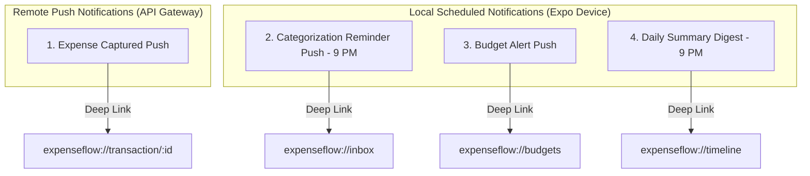

# Analytics & Notification Architecture Specification

## 1. Overview
This document defines the specification for Dashboard Widgets, Analytics Visualizations, Chart UI Contracts, Spending Metrics Mathematical Formulas, and Push Notification Lifecycles in ExpenseFlow AI V1.1.

---

## 2. Scope
* **Included in V1.1:** 6 Core Dashboard Widgets, Analytics Chart Inventory (Category Donut, Daily Bars, Weekly Bars, Monthly Trend, Merchant Leaderboard, Budget Progress Cards), Mathematical Metric Formulas, Notification Timeline Table, and Notification Lifecycles classified into Remote Push vs. Local Scheduled Notifications with deep-linking support (`expenseflow://transaction/:id`).
* **Excluded in V1.1:** Custom export PDF generator, automated SMS summary dispatch.

---

## 3. Responsibilities
* **Analytics Component:** Aggregates MongoDB / SQLite data into visual charts and cards using exact mathematical formulas.
* **Notification Engine (`expo-notifications`):** Manages remote push reminders and local scheduled triggers.

---

## 4. Analytics & Dashboard Metrics Mathematical Formulas

```latex
\[ \text{Today's Spend} = \sum \{ \text{amount}_i \mid \text{status}_i = \text{COMPLETED} \land \text{date}(\text{occurredAt}_i) = \text{today}() \} \]

\[ \text{Weekly Spend} = \sum \{ \text{amount}_i \mid \text{status}_i = \text{COMPLETED} \land \text{occurredAt}_i \ge \text{startOfWeek}() \} \]

\[ \text{Monthly Spend} = \sum \{ \text{amount}_i \mid \text{status}_i = \text{COMPLETED} \land \text{occurredAt}_i \ge \text{startOfMonth}() \} \]

\[ \text{Budget Progress \%} = \left( \frac{\text{Monthly Category Spend}}{\text{Category Budget Limit}} \right) \times 100 \]

\[ \text{Avg AI Confidence \%} = \left( \frac{\sum_{i=1}^{N} \text{aiConfidence}_i}{N} \right) \times 100 \]
```

| Metric Name | Formula / Aggregation Logic | Unit |
| :--- | :--- | :--- |
| **Today's Spend** | Sum of `amount` where `status = COMPLETED` and `occurredAt = today` | $\text{₹ (INR)}$ |
| **Weekly Spend** | Sum of `amount` where `status = COMPLETED` and `occurredAt >= startOfWeek` | $\text{₹ (INR)}$ |
| **Monthly Spend** | Sum of `amount` where `status = COMPLETED` and `occurredAt >= startOfMonth` | $\text{₹ (INR)}$ |
| **Pending Inbox Count** | Count of documents where `status = PENDING_CATEGORY` | `Integer` |
| **Budget Progress %** | `(Category Monthly Spend / Category Budget Limit) * 100` | `%` |
| **Avg AI Confidence** | Average of `aiConfidence` across all AI suggested transactions | `%` |

---

## 5. Analytics UI Chart Inventory (UI Contracts)

### 1. Category Donut Chart
* **Purpose:** Visual percentage breakdown of spending by category (Food & Dining 57%, Shopping 26%, Transportation 17%).
* **Query Source / API:** `GET /api/v1/analytics/summary` (Remote) / `local_transactions` SQL aggregation (Local).
* **SQLite Fallback:** `SELECT category, SUM(amount) FROM local_transactions WHERE status='COMPLETED' GROUP BY category`.
* **Empty State:** "Not enough categorized payments to generate donut breakdown."
* **Error State:** Red alert container with "Unable to load category breakdown".
* **Offline Behavior:** Calculates breakdown directly from SQLite `local_transactions`.
* **Interactivity:** Tapping a donut slice filters the Merchant Leaderboard below.

### 2. Daily Spend Bar Chart
* **Purpose:** Bar chart showing total spending per hour/day for the current date.
* **Query Source / API:** `GET /api/v1/analytics/daily` (Remote) / `local_transactions` SQL query (Local).
* **Empty State:** "No payments recorded today."
* **Offline Behavior:** Computed using local SQLite records.

### 3. Weekly Spend Bar Chart
* **Purpose:** 7-day bar chart comparing current week spend vs. previous week baseline.
* **Query Source / API:** `GET /api/v1/analytics/weekly` / SQLite aggregation.
* **Empty State:** "No spending recorded this week."
* **Offline Behavior:** Computed using local SQLite records.

### 4. Monthly Spend Trend Line Chart
* **Purpose:** Line chart displaying daily cumulative spend trajectory against monthly budget threshold.
* **Query Source / API:** `GET /api/v1/analytics/monthly` / SQLite aggregation.
* **Empty State:** "No spending recorded this month."
* **Offline Behavior:** Computed using local SQLite records.

### 5. Merchant Ranking Leaderboard
* **Purpose:** Top 10 merchants ranked by total spend amount with logo avatar and payment count.
* **Query Source / API:** `GET /api/v1/analytics/merchants` / SQLite aggregation.
* **SQLite Fallback:** `SELECT merchant, SUM(amount) AS total, COUNT(*) FROM local_transactions WHERE status='COMPLETED' GROUP BY merchant ORDER BY total DESC LIMIT 10`.
* **Empty State:** "No merchant data available."
* **Offline Behavior:** Computed using local SQLite records.

### 6. Budget Progress Cards Widget
* **Purpose:** Category budget limit progress bars with color-coded alerts ($<75\%$ Green, $75-90\%$ Orange, $>90\%$ Red).
* **Query Source / API:** `GET /api/v1/budgets` / `local_categories` JOIN `local_transactions`.
* **Empty State:** "No active category budgets."
* **Offline Behavior:** Computed using local SQLite records.

---

## 6. Notification Timeline & Trigger Table

| Notification Name | Trigger Condition | Scheduled Time | Deep Link URL | Offline Support | Cancel Behavior |
| :--- | :--- | :--- | :--- | :---: | :--- |
| **Expense Captured** | API receives SMS payload (`POST /capture/sms`) | Instant upon SMS ingestion | `expenseflow://transaction/:id` | ❌ (Remote Push) | Swiping dismisses notification. |
| **Pending Categorization Reminder** | Pending Inbox Count $> 0$ | 9:00 PM Daily | `expenseflow://inbox` | ✅ (Local Scheduled) | Cancels automatically when pending count reaches 0. |
| **Budget Threshold Alert** | Category spend reaches $85\%$ of limit | Instant upon transaction update | `expenseflow://budgets` | ✅ (Local Trigger) | Dismisses upon tap. |
| **Daily Summary Digest** | Daily recurring alarm | 9:00 PM Daily | `expenseflow://timeline` | ✅ (Local Scheduled) | User can toggle off in Settings. |

---

## 7. Notification Classification & Lifecycle

Notifications are classified into **Remote Push Notifications** (dispatched by API Gateway) and **Local Scheduled Notifications** (dispatched natively by `expo-notifications` on device):



---

## 8. Error Handling & Offline Behavior
* **Offline Notifications:** Local scheduled notifications trigger natively using `expo-notifications` even when device is in Flight Mode.

---

## 9. Acceptance Criteria

### Feature Completion Checklist
- [x] Mathematical formulas for all 5 analytics metrics defined.
- [x] Chart Inventory UI contracts for 6 analytics visual components documented.
- [x] Notification Timeline Table (triggers, time, deep links, offline support, cancel behavior) specified.
- [x] Notification classification (Remote vs Local Scheduled) documented with deep links (`expenseflow://transaction/:id`).

---

## 10. Future Improvements (V2 Upgrade Path)
* **Custom Notification Quiet Hours:** User-configurable notification silence windows.
