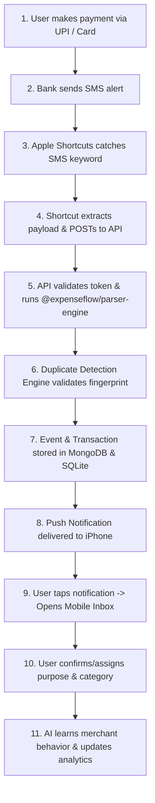

# Product Roadmap & Primary User Journeys

## Primary User Journey (Step-by-Step)

---

## 10-Phase Implementation Roadmap

### Phase 1 — Foundation & Monorepo Setup (Current Phase)
* **Tasks:** Initialize Turborepo + PNPM workspace, setup configuration packages (`config`, `logger`, `shared-types`), compile complete `docs/` architectural specifications.
* **Deliverable:** Fully configured monorepo baseline with static typechecks passing.

### Phase 2 — SMS Parser Engine (`@expenseflow/parser-engine`)
* **Tasks:** Implement bank parsers (HDFC, ICICI, SBI, Axis, Kotak, IDFC, Generic), SHA-256 fingerprinting generator, duplicate detection engine, unit tests.
* **Deliverable:** Isolated test-driven parser package with >95% bank SMS regex coverage.

### Phase 3 — Database & Core Backend Modules
* **Tasks:** MongoDB schema definitions, Mongoose models, Express bounded context controllers (Capture, Transactions, Categories, Merchants, Users, Auth), Zod DTO validation middleware.
* **Deliverable:** Fully functional backend API with Dockerized MongoDB & Redis environment.

### Phase 4 — Offline Sync Engine & SQLite Layer
* **Tasks:** Mobile SQLite repository layer (`expo-sqlite`), `pending_sync_queue` implementation, backend `/sync/push` and `/sync/pull` delta endpoints, LWW conflict resolution.
* **Deliverable:** Dual-database offline sync module passing edge-case disconnect/reconnect tests.

### Phase 5 — Mobile Inbox & Core UI Screens
* **Tasks:** Expo Router setup, Home dashboard, Inbox pending review screen, Transaction detail modal, Reanimated swipe gesture actions, Zustand store bindings.
* **Deliverable:** Fluid 60fps mobile application handling pending approval workflows.

### Phase 6 — Merchant Intelligence & Category Engine
* **Tasks:** Hierarchical nested category management, Merchant Memory engine feedback loops, automatic categorization confidence scoring.
* **Deliverable:** Self-learning merchant intelligence system updating categories upon user confirmation.

### Phase 7 — Background Workers & Analytics Pipeline
* **Tasks:** BullMQ Redis setup, worker services (`analytics-worker`, `notification-worker`, `scheduler`), MongoDB aggregation rollups.
* **Deliverable:** Asynchronous spend calculation and scheduled notifications.

### Phase 8 — Local AI Integration (Ollama + Qwen2.5:14B)
* **Tasks:** `ai-worker` service, Ollama API connector, structured JSON prompt templates, RAG vector embeddings (`nomic-embed-text`), natural language chat backend.
* **Deliverable:** Privacy-first AI assistant and automatic categorization engine.

### Phase 9 — Budgets & Deep-linked Notifications
* **Tasks:** Budget threshold calculation, overspend alert triggers, Expo push notification dispatcher, deep-linking URL handlers (`expenseflow://transaction/:id`).
* **Deliverable:** Automated budget enforcement with actionable push notifications.

### Phase 10 — Web Dashboard, DevOps & Production Deployment
* **Tasks:** Next.js App Router Web Dashboard (Shadcn UI + TailwindCSS), Docker Compose production orchestration, GitHub Actions CI/CD workflows, Cloudflare Tunnel setup for iOS device testing.
* **Deliverable:** Production-ready multi-platform financial intelligence ecosystem.
