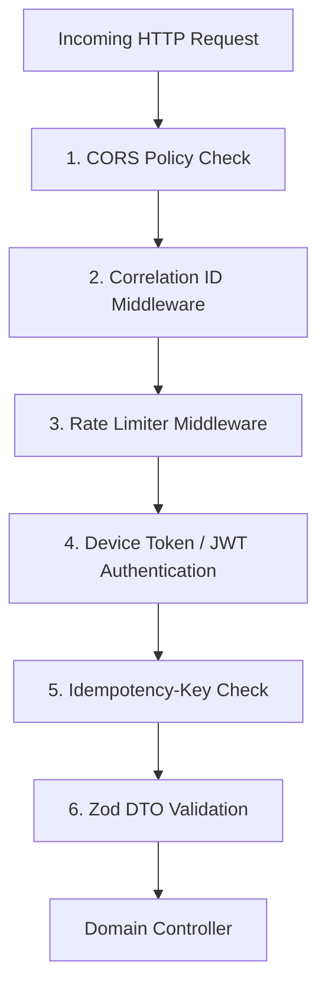

# Security Architecture Specification

## Overview

ExpenseFlow AI adopts a zero-trust, privacy-first security model. Financial transaction data, account masks, and device authorization credentials must be protected against unauthorized access, network interception, and data leaks.

---

## 1. Data Encryption at Rest (AES-256-GCM)

All sensitive fields stored in MongoDB and SQLite databases are encrypted at rest using **AES-256-GCM** (Galois/Counter Mode) with random initialization vectors (IV) and authentication tags:

| Field Name | Storage Location | Encryption Strategy |
| :--- | :--- | :--- |
| `accountMasked` | `transactions`, `local_transactions` | AES-256-GCM Encrypted |
| `reference` | `transactions`, `local_transactions` | AES-256-GCM Encrypted |
| `deviceToken` | `device_tokens`, `Expo SecureStore` | AES-256-GCM Encrypted |
| `rawSMS` | `transactions.metadata` | AES-256-GCM Encrypted |

```typescript
// AES-256-GCM Encryption / Decryption Helper
import { createCipheriv, createDecipheriv, randomBytes } from 'crypto';

const ALGORITHM = 'aes-256-gcm';
const SECRET_KEY = Buffer.from(process.env.ENCRYPTION_KEY || '', 'hex'); // 32 bytes

export function encrypt(text: string): { ciphertext: string; iv: string; tag: string } {
  const iv = randomBytes(12);
  const cipher = createCipheriv(ALGORITHM, SECRET_KEY, iv);
  let encrypted = cipher.update(text, 'utf8', 'hex');
  encrypted += cipher.final('hex');
  const tag = cipher.getAuthTag().toString('hex');

  return { ciphertext: encrypted, iv: iv.toString('hex'), tag };
}

export function decrypt(ciphertext: string, iv: string, tag: string): string {
  const decipher = createDecipheriv(ALGORITHM, SECRET_KEY, Buffer.from(iv, 'hex'));
  decipher.setAuthTag(Buffer.from(tag, 'hex'));
  let decrypted = decipher.update(ciphertext, 'hex', 'utf8');
  decrypted += decipher.final('utf8');
  return decrypted;
}
```

---

## 2. API Gateway Security Stack

All incoming HTTP requests to the REST API pass through a strict gateway security pipeline:



### Gateway Security Components
1. **CORS Policy:** Strict origin checks (`https://app.expenseflow.ai`).
2. **Correlation ID (`X-Correlation-ID`):** UUIDv4 injected into request header and attached to all Pino log traces.
3. **Rate Limiting:** IP and token bucket rate limiting (100 req/min for general API, 20 req/min for Ingestion API).
4. **Device Token Authorization:** Ingestion requests require `X-Device-Token` matched against hashed values in `device_tokens`.
5. **Idempotency-Key Header (`Idempotency-Key`):** Guarantees mutation endpoints (`POST`, `PATCH`) process duplicate requests idempotently via Redis cache keys.
6. **HTTPS Strict Transport:** Enforced SSL/TLS 1.3 encryption for all network traffic.
